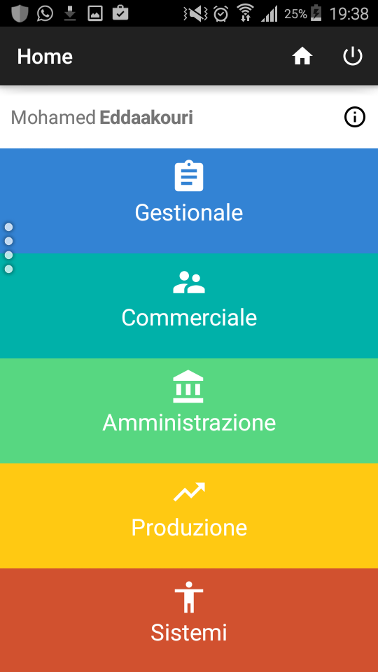
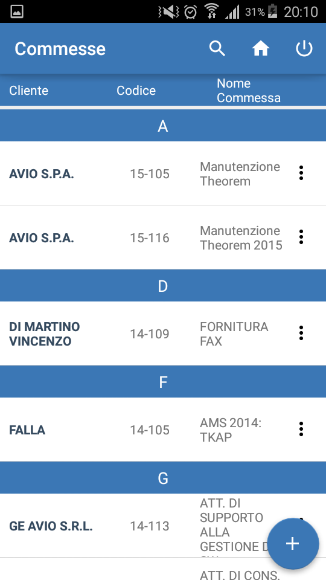
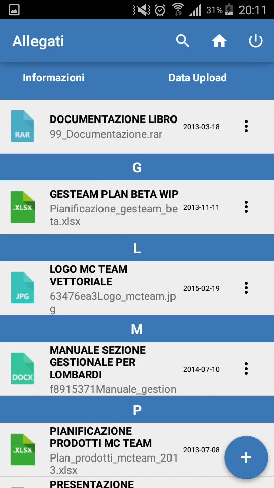
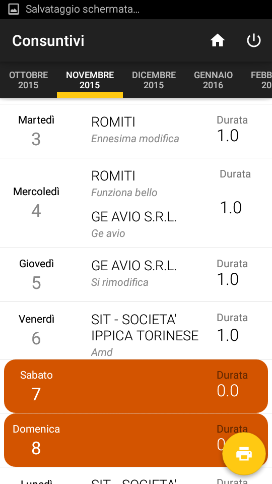
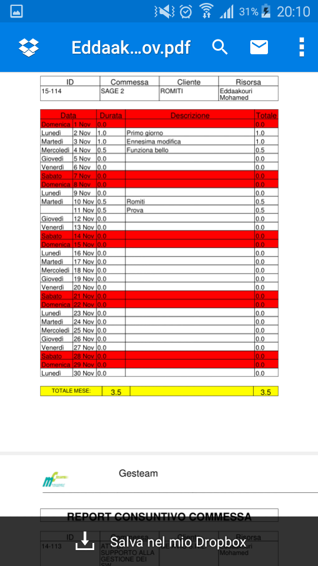

# GestApp

# SunMemories

SunMemorie is an Android application that communicate with a LED Lamp via Bluetooth 4.0 (GATT protocol)

ACTIVITIES
===================
  *LOGIN 

 
 
  *HOME
 
  
  
  *RUBRICA 

  
  
  *ALLEGATI
  
  
  
  *CONSUNTIVI
  
  
    
  *STAMPA
  
  
  
  LIBRERIES
===================

- [FloatingActionButton](https://github.com/makovkastar/FloatingActionButton) 
- [Gson](https://github.com/google/gson) 
- [Android Bootstrap](https://github.com/Bearded-Hen/Android-Bootstrap) 
- [Volley HTTP Framework](https://android.googlesource.com/platform/frameworks/volley) 
- [iTextPdf](http://itextpdf.com/) 

